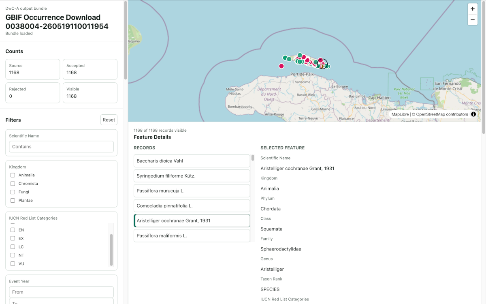
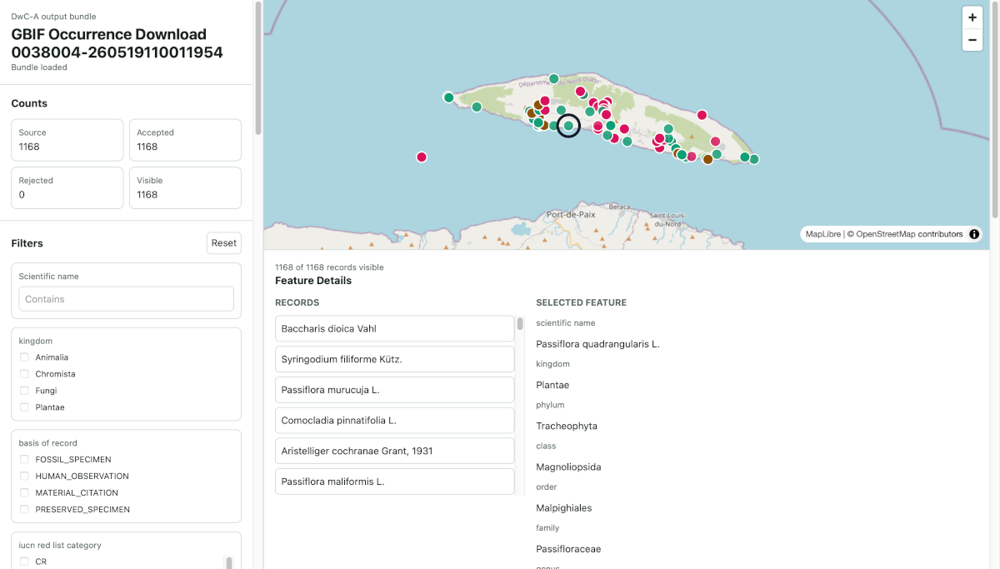

# Project Overview

Status: Public prototype overview

Last updated: 2026-06-24

## What It Is

DwC-A to Cloud-Optimized Geospatial Formats is a local converter for Darwin
Core Archive occurrence datasets. It reads an already downloaded DwC-A archive,
extracts georeferenced occurrence records, writes cloud-friendly geospatial
files and packages them with metadata, validation evidence and a lightweight
static MapLibre viewer.

The project is designed for biodiversity data publishers, data managers,
researchers and tool builders who need a repeatable path from DwC-A exchange
files to portable geospatial assets that can be hosted, inspected and reused
without operating a geospatial server.

## Ways To Use

The tool can be used through three entry points, depending on the user's
workflow:

- GUI: run `dwca-cloud-geospatial-gui` for a simple desktop workflow.
- CLI: run `dwca-cloud-geospatial inspect`, `convert` and `validate` for
  repeatable command-line processing.
- Python API: import `dwca_cloud_geospatial` and call the core conversion and
  validation APIs from Python code.

## Impact And Use Cases

Darwin Core Archive is a strong biodiversity data exchange format, but it is
not always convenient for direct static web publishing, map review or
analytical geospatial workflows. This project keeps DwC-A provenance while
producing formats that are easier to serve and inspect:

- FlatGeobuf for lightweight geospatial exchange and browser map loading.
- GeoParquet for analytical workflows and larger geospatial data processing.
- GeoPackage as a retained staging and audit artifact when FlatGeobuf is
  generated.
- JSON metadata, a manifest and rejection reports that explain how the bundle
  was produced.
- A copied static viewer that can open the generated bundle from ordinary
  static hosting.

The workflow lowers the infrastructure barrier for reviewing and sharing
GBIF-mediated and other Darwin Core occurrence data. Generated bundles retain
source archive metadata, row-level provenance, quality flags, citation fields,
license fields and optional GBIF occurrence download DOI/citation provenance
when available.

Primary use cases:

- Publish a static, reviewable map from a local DwC-A occurrence archive.
- Create GeoParquet files for downstream analytical workflows while preserving
  source provenance and quality decisions.
- Give data managers a repeatable inspect-convert-validate workflow before
  sharing derived geospatial assets.
- Package data, metadata, validation output and a viewer together so a bundle
  can be reviewed without a project-specific backend.

## Innovation

The prototype combines several practical design choices in one portable
workflow:

- A static output bundle with `manifest.json`, metadata, geospatial files,
  reports and a copied viewer.
- Multiple user entry points: GUI, CLI and Python API call the same core
  conversion and validation logic.
- Cloud-optimized geospatial outputs for different audiences: FlatGeobuf for
  map loading and exchange, GeoParquet for analysis, and retained GeoPackage
  staging for audit/download.
- Provenance-first conversion that keeps source archive metadata, source row
  context, DOI/citation/license fields and structured processing warnings.
- No required database, permanent backend, scheduler, cloud runtime or live
  biodiversity-data API after conversion.
- Bounded parser/normalizer/writer handoff for large-output workflows, with
  validation designed to separate required bundle failures from optional
  dependency-dependent checks.

## How It Works

The converter follows a file-based pipeline:

1. Inspect the local DwC-A archive or unpacked DwC-A directory.
2. Parse `meta.xml` to locate the declared Occurrence core and coordinate
   fields.
3. Stream occurrence rows and preserve source file, source row and source
   record identifiers.
4. Normalize Darwin Core, Dublin Core, GBIF, OBIS and IUCN source terms into a
   stable project-owned occurrence schema.
5. Reject records with missing or invalid critical coordinates and write
   accepted records to selected geospatial outputs.
6. Write `manifest.json`, `metadata/source.json`, `metadata/processing.json`
   and `reports/rejected_records.csv` when records are rejected.
7. Copy the static viewer into the generated bundle so reviewers can open the
   result from static files.

The baseline conversion does not download archives, create GBIF occurrence
downloads, require credentials, run a database or start a backend service.
Optional GBIF DOI/citation enrichment is an explicit conversion-time lookup
only; generated bundles remain static.

## Inputs

Supported MVP inputs:

- A `.zip` Darwin Core Archive.
- An unpacked Darwin Core Archive directory with `meta.xml` at the directory
  root.
- Occurrence-core archives that declare `decimalLatitude` and
  `decimalLongitude`.

Inspectable but not converted in the MVP:

- Checklist archives with a `Taxon` core and no Occurrence core.
- Occurrence archives without declared coordinate terms.

## Outputs

Default FlatGeobuf bundles include:

```text
output/
  index.html
  styles.css
  app.js
  README.md
  manifest.json
  metadata/
    source.json
    processing.json
  data/
    occurrences.gpkg
    occurrences.fgb
  reports/
    rejected_records.csv
```

Explicit GeoParquet output adds or writes:

```text
data/occurrences.parquet
```

Important output properties:

- `manifest.json` is the discovery document for tools and the viewer.
- `metadata/source.json` records source archive, dataset, rights and available
  GBIF/OBIS provenance.
- `metadata/processing.json` records converter version, configuration, counts,
  warnings, validation status and parser diagnostics.
- `reports/rejected_records.csv` is written only when at least one row is
  rejected or skipped.
- `data/occurrences.fgb` is the default browser map layer.
- `data/occurrences.parquet` is the analytical GeoParquet artifact when
  selected.

## How To Run It

Create and activate a local development environment:

```bash
git clone https://github.com/ABiatov/dwca-cloud-geospatial.git
cd dwca-cloud-geospatial
export REPO="$(pwd)"
python -m venv "${REPO}/.venv"
source "${REPO}/.venv/bin/activate"
python -m pip install --upgrade pip
python -m pip install -e "${REPO}[dev,flatgeobuf,validation]"
```

### Use The CLI

Inspect an archive:

```bash
dwca-cloud-geospatial inspect /path/to/archive.zip
dwca-cloud-geospatial inspect --json /path/to/archive.zip
```

Convert a local occurrence fixture into the default FlatGeobuf bundle:

```bash
dwca-cloud-geospatial convert \
  "${REPO}/tests/fixtures/dwca/minimal_occurrence/normalization" \
  "${REPO}/scratch/sample-bundle" \
  --overwrite
```

Convert the documented demo archive after downloading it with the instructions
in [demo/README.md](../demo/README.md). This writes a demo bundle to
`demo/output`, overwrites any previous local demo output and opts in to
read-only GBIF DOI/citation enrichment:

```bash
dwca-cloud-geospatial convert \
  "${REPO}/demo/source/0038004-260519110011954.zip" \
  "${REPO}/demo/output" \
  --gbif-download-key 0038004-260519110011954 \
  --gbif-doi 10.15468/dl.3xbk5b \
  --gbif-citation "GBIF.org (4 June 2026) GBIF Occurrence Download https://doi.org/10.15468/dl.3xbk5b" \
  --gbif-license CC_BY_NC_4_0 \
  --gbif-enrich \
  --overwrite
```

Validate the generated bundle:

```bash
dwca-cloud-geospatial validate "${REPO}/scratch/sample-bundle"
```

Validate the demo bundle:

```bash
dwca-cloud-geospatial validate "${REPO}/demo/output"
```

Serve the repository or output parent as static files:

```bash
python -m http.server 8000 --directory "${REPO}"
```

Open the generated viewer:

```text
http://localhost:8000/scratch/sample-bundle/index.html
```

Open the demo viewer:

```text
http://localhost:8000/demo/output/index.html
```

For a GeoParquet analytical output:

```bash
dwca-cloud-geospatial convert \
  /path/to/archive.zip \
  /path/to/output-bundle \
  --format geoparquet
```

### Use The Python API

The import package is `dwca_cloud_geospatial`. Python callers can use the same
core conversion and validation APIs that the CLI and GUI call.

```python
from pathlib import Path

from dwca_cloud_geospatial.conversion import (
    ConversionOptions,
    convert_dwca_archive,
)
from dwca_cloud_geospatial.validation import validate_output_bundle

repo = Path.cwd()
archive = repo / "tests/fixtures/dwca/minimal_occurrence/normalization"
output = repo / "scratch/sample-bundle"

result = convert_dwca_archive(
    archive,
    output,
    options=ConversionOptions(
        output_formats=("flatgeobuf",),
        overwrite=True,
    ),
)

validation = validate_output_bundle(result.output_directory)
print(validation.status)
```

For GeoParquet output, change `output_formats`:

```python
ConversionOptions(output_formats=("geoparquet",), overwrite=True)
```

### Run The GUI

The prototype GUI uses `tkinter` and calls the same conversion and validation
APIs as the command-line workflow.

```bash
dwca-cloud-geospatial-gui
```

If the console script is not on `PATH`, run it through the local virtual
environment:

```bash
"${REPO}/.venv/bin/dwca-cloud-geospatial-gui"
```

GUI screenshot:



## Demo And Supporting Materials

- YouTube video: TODO: add YouTube URL here.
- Medium post:
  [How to Convert and Stream Biodiversity Data with FlatGeobuf, GeoParquet, and Zero Infrastructure](https://medium.com/@anton.biatov/how-to-convert-and-stream-biodiversity-data-with-flatgeobuf-geoparquet-and-zero-infrastructure-de303715c160).
- Google Colab demo notebook:
  [examples/DWCA-Cloud-Geospatial_Demo_Notebook.ipynb](../examples/DWCA-Cloud-Geospatial_Demo_Notebook.ipynb).
  Open in Colab:
  [DWCA-Cloud-Geospatial Demo Notebook](https://colab.research.google.com/drive/1qc0yYgmtGMnOcQNpvY4HevhBzHibf6eb?usp=sharing).
  The notebook installs the converter in Colab, downloads the GBIF demo
  DwC-A archive, runs `inspect`, `convert` and `validate`, and downloads the
  generated FlatGeobuf, GeoPackage, GeoParquet and complete static bundle.
- Source repository: [ABiatov/dwca-cloud-geospatial](https://github.com/ABiatov/dwca-cloud-geospatial)
- Demo screenshots: see the GUI and static viewer screenshots below.
- Demo bundle: generated locally from the dataset described in [demo/README.md](../demo/README.md).

Dataset citation for the Colab and demo bundle:

```text
GBIF.org (4 June 2026) GBIF Occurrence Download https://doi.org/10.15468/dl.3xbk5b
```

The demo conversion passes the GBIF download key
`0038004-260519110011954`, DOI `10.15468/dl.3xbk5b`, citation text and
license `CC_BY_NC_4_0` explicitly so they are preserved in generated bundle
metadata. If you use the `--gbif-enrich` flag, the converter performs a
read-only GBIF occurrence download metadata lookup when a download key is
supplied or inferred; it does not create downloads or perform occurrence
search.

Viewer screenshot:



The video should show the input DwC-A archive, conversion command or GUI
workflow, generated output files, validation result and static viewer opening
the generated bundle. The Medium post can summarize the motivation, workflow,
implementation choices, limitations and next steps.

## Current Quality Evidence

Local verification on 2026-06-21:

```text
97 passed, 1 skipped
```

The test suite covers DwC-A inspection, occurrence row parsing, occurrence
normalization, conversion, GeoParquet writing, FlatGeobuf and GeoPackage
staging, bundle metadata, bundle validation, CLI behavior, GUI option handling
and static viewer contract behavior.

## Known Limitations

- The converter writes geospatial outputs only from occurrence archives with
  declared coordinate terms.
- Multi-file occurrence-core streaming is deferred.
- PMTiles generation is deferred.
- Browser GeoParquet loading is deferred; GeoParquet-only bundles open as
  metadata, provenance and artifact inventory pages.
- Partitioned GeoParquet datasets are rejected until manifest and validation
  contracts support partition file inventories.
- FlatGeobuf conversion avoids Python-side full accepted-record
  materialization by staging through GeoPackage, but GDAL may still need
  substantial memory while building the final indexed FlatGeobuf.
- The copied viewer currently uses public frontend CDN assets and an
  OpenStreetMap raster basemap; fully offline hosting must mirror those assets
  or replace the references.

## Documentation Map

- [Converter API and CLI](converter.md)
- [Output format](output_format.md)
- [Static viewer contract](viewer_contract.md)
- [Deployment and demo review](deployment.md)
- [Developer setup](developer_setup.md)
- [DwC-A parser and normalization handoff](dwca_parser.md)
